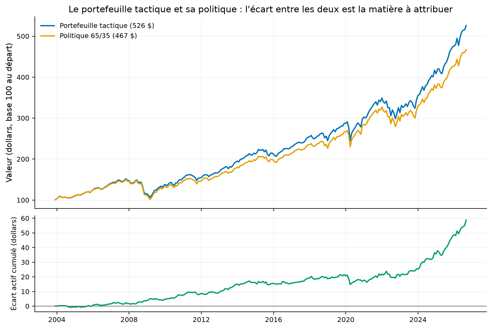
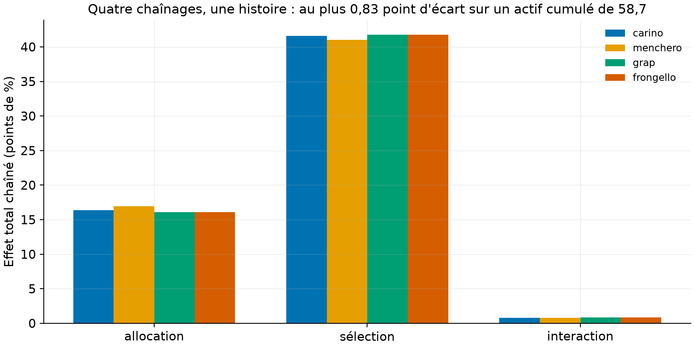
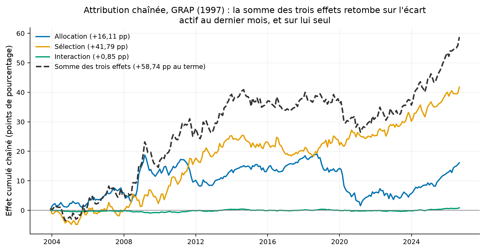

# L'attribution de performance qui tombe juste : quatre chaînages, un exemple GIPS, zéro pouce

Les effets de Brinson d'un mois s'additionnent exactement ; ceux de vingt-trois ans, non.
Ce dépôt implémente les quatre méthodes de chaînage qui réconcilient l'attribution
multi-périodes, exige la réconciliation à 1e-12 près par test, et valide les trois
rendements du GIPS sur l'exemple chiffré officiel du Handbook. *English summary below.*

Le même contenu en PDF : [rapport/rapport.pdf](rapport/rapport.pdf).

## En bref

1. **Les quatre chaînages racontent la même histoire.** Sur 274 mois d'un portefeuille
   tactique contre sa politique (+58,74 points de pourcentage d'écart actif cumulé), Cariño, Menchero,
   GRAP et Frongello attribuent l'allocation entre +16,11 et +16,93 points et la sélection
   entre +41,01 et +41,79 : au plus 0,83 point d'écart entre méthodes, soit 1,4 % du total
   à expliquer. Le choix de la méthode est un choix de présentation, pas de verdict.
   (Mesuré.)
2. **GRAP et Frongello ont des totaux EXACTEMENT égaux, une identité redémontrée et
   testée ici.** En développant la récursion de Frongello, le coefficient total de l'effet
   du mois t vaut le facteur GRAP (le passé au portefeuille, le futur au benchmark) : les
   chemins mensuels diffèrent, les totaux coïncident à 1e-12 (testé). L'identité est
   absente des deux papiers originaux mais connue de la littérature de synthèse (la
   « famille dollar » de Cariño 2002 ; Bacon 2019, rapporté). (Mesuré et démontré.)
3. **Chaque méthode réconcilie exactement, ou le test échoue.** La somme des effets
   chaînés doit égaler (1+Rp_1)...(1+Rp_T) - (1+Rb_1)...(1+Rb_T) : résidu maximal observé
   4,8e-15. Et les trois rendements réglementaires (TWR, Dietz modifié, MWR) retombent sur
   l'exemple du GIPS Standards Handbook for Firms 2020 : 15,31 % et 15,63 % (p. 103-105,
   rapporté), au centième. (Mesuré.)

## La question

Un comité de placement lit « l'allocation a rapporté +2,1 points cette année ». Or ce
chiffre n'existe pas naturellement : les effets mensuels de Brinson s'additionnent à
l'écart actif du mois, mais leur somme sur l'année ne retombe PAS sur l'écart actif
annuel, car les rendements se composent. Quatre méthodes concurrentes redistribuent les
effets pour forcer la réconciliation. Donnent-elles le même verdict, ou l'attribution
dépend-elle de la méthode ?

## Le banc d'essai (données du dépôt 03, règle déclarée)

Aucune donnée nouvelle : les six FNB canadiens du dépôt 03 (Yahoo, usage personnel,
jamais commités), 274 mois de novembre 2003 à août 2026. La politique : 65 % actions
(XIU, XSP, XIN, XRE en mélange fixe), 35 % obligations (XBB, XSB). Le portefeuille
tactique s'en écarte par une règle déclarée de momentum 12-1 (le rendement cumulé des
mois t-12 à t-2, calculé au début du mois : rien du mois attribué n'entre dans les
poids) : +5 points à la classe gagnante (matière à ALLOCATION), +10 points de poids de
classe au FNB gagnant dans chaque classe (matière à SÉLECTION), le transfert plafonné au
poids du FNB perdant pour ne jamais créer de poids négatif (7,69 points quand XRE est le
perdant, le cas dans 92 mois sur 274, mesuré). Résultat brut : 7,54 %
par an contre 6,99 % pour la politique, +0,56 point par an AVANT tout coût de
transaction (déclaré ; la règle tourne chaque mois, les coûts mangeraient une partie).

## Volet 1 : Brinson-Fachler, l'identité de départ

L'attribution de Brinson et Fachler (1985) découpe l'écart actif d'UNE période en trois :
l'allocation, récompense d'avoir surpondéré une classe qui bat le benchmark total ; la
sélection, récompense d'avoir mieux fait que le benchmark dans la classe ; l'interaction,
le croisement des deux. La somme des trois, sommée sur les classes, égale Rp - Rb du mois,
exactement (testé à 1e-14 sur panels aléatoires).



**Comment lire cette figure.** En haut, 100 $ dans le portefeuille tactique et dans la
politique ; en bas, l'écart cumulé entre les deux : +58,74 points en fin de période.
C'est ce trait vert que l'attribution doit expliquer morceau par morceau.

## Volet 2 : les quatre chaînages (mesuré, `results/tables/totaux_par_methode.csv`)

Chaque méthode multiplie l'effet du mois t par un coefficient qui force la somme totale
à retomber sur l'écart actif cumulé. Cariño (1999) passe par les logarithmes ; Menchero
(2000) par un coefficient commun plus un correctif proportionnel à l'écart du mois ;
GRAP (1997) capitalise le passé au portefeuille et le futur au benchmark ; Frongello
(2002) par une récursion qui porte l'histoire des effets déjà ajustés. Les formules sont
recoupées contre l'implémentation de référence R-Finance/PortfolioAttribution (MIT).

| Effet total chaîné (points de pourcentage) | Cariño | Menchero | GRAP | Frongello |
|---|---|---|---|---|
| Allocation | +16,38 | +16,93 | +16,11 | +16,11 |
| Sélection | +41,58 | +41,01 | +41,79 | +41,79 |
| Interaction | +0,78 | +0,79 | +0,85 | +0,85 |
| **Somme** | **+58,74** | **+58,74** | **+58,74** | **+58,74** |

**Lecture guidée.** Les sommes sont identiques par construction (résidu maximal 4,8e-15,
table `residus_reconciliation.csv`) ; le verdict, lui, ne dépend pas de la méthode : la
sélection intra-classe explique 70 % de la valeur ajoutée quel que soit le chaînage, et
l'écart maximal entre méthodes (0,83 point, sur l'allocation) vaut 1,4 % du total à
expliquer. Les colonnes GRAP et Frongello sont identiques ligne à ligne : l'identité de
la « famille dollar » (Cariño 2002 ; Bacon 2019, rapporté), redémontrée ici par expansion
de la récursion et testée à 1e-12 (test `test_frongello_totals_equal_grap_totals_theorem`) ;
les deux papiers originaux ne la signalent pas l'un pour l'autre (vérifié sur les PDF).
Détail d'implémentation qui compte : dans le cas limite où les cumuls du portefeuille et
du benchmark coïncident exactement par des chemins différents, l'implémentation R de
référence perd la réconciliation (alpha forcé à zéro) ; la nôtre garde le correctif et
réconcilie (testé).



**Comment lire cette figure.** Une barre par méthode et par effet, non pas en niveau mais
en ÉCART À LA MOYENNE des quatre méthodes, en points de base. Les niveaux, de 16 à 42
points de pourcentage, écrasaient des différences qui valent au plus 83 points de base :
tracés en écart, ils deviennent lisibles, et deux faits sautent aux yeux. Les barres GRAP
et Frongello sont rigoureusement identiques, ce qui est l'identité redémontrée plus haut ;
Menchero est la seule méthode qui s'écarte, de +55 points de base sur l'allocation et de
-53 sur la sélection, l'un compensant l'autre puisque les totaux sont contraints. Sur un
écart actif cumulé de 5 874 points de base, le choix de la méthode ne change donc pas le
message au comité.



**Comment lire cette figure.** Le chemin cumulé des trois effets chaînés (GRAP). La
sélection (jaune) fait le gros du travail et accélère après 2020 ; l'allocation (bleu)
donne et reprend (elle perd 17 points entre 2018 et 2021 : surpondérer la classe
momentum a coûté cher dans les retournements) ; l'interaction reste marginale. La somme
(tirets) retombe exactement sur l'écart actif de la figure précédente AU DERNIER MOIS, et
sur lui seul : le coefficient GRAP du mois i contient les rendements postérieurs à i, si
bien qu'une somme partielle n'est pas l'attribution arrêtée à cette date. Lire la courbe
en tirets comme l'écart actif courant serait une erreur ; c'est la propriété de tous les
chaînages de la famille dollar.

## Volet 3 : TWR, Dietz modifié, MWR, validés sur l'exemple officiel

Le rendement pondéré par le temps (TWR), la norme GIPS pour juger le GESTIONNAIRE,
neutralise les flux du client en revalorisant à chaque flux important et en enchaînant
les sous-périodes. Le Dietz modifié l'approxime sans revalorisation, chaque flux pondéré
par la fraction de période où il travaille. Le rendement pondéré par l'argent (MWR), le
taux interne, juge l'EXPÉRIENCE DU CLIENT, moment des flux compris.

Exemple du GIPS Standards Handbook for Firms 2020, p. 103-105 (rapporté ; PDF public
chez CFA Institute, jamais commité) : valeur initiale 100 000 $, retrait de 2 000 $ au
jour 6, apport de 20 000 $ au jour 11, valeur finale 135 000 $, mois de 30 jours.

| Mesure | Notre moteur | Handbook |
|---|---|---|
| Dietz modifié | 15,306 % | 15,31 % |
| Sous-période 1 (Dietz revalorisé au jour 11) | 7,064 % | 7,06 % |
| TWR (chaînage des deux sous-périodes) | 15,629 % | 15,63 % |
| MWR (taux interne du mois) | 15,349 % | non imprimé |

**Lecture guidée.** Le Dietz au denominateur : 100 000 - 2 000 x 24/30 + 20 000 x 19/30
= 111 067 $ ; gain de 17 000 $ ; 15,31 %. Le TWR revalorise au grand flux : la
sous-période 1 est elle-même un Dietz (7 000/99 091 = 7,0642 %, le Handbook imprime ce
calcul p. 104), la seconde vaut 8,00 %, et le chaînage retombe exactement sur le 15,63 %
imprimé : les trois lignes sortent du MÊME moteur, aucun chiffre recopié. Le MWR tombe
entre les deux : l'apport de 20 000 $ est arrivé avant la bonne sous-période, le client a
fait un peu mieux que le Dietz ne le dit.

## Reproduire

```bash
uv sync --locked --all-extras
uv run pytest           # 12 tests : identités exactes, GIPS au centième, théorème GRAP-Frongello
uv run perf fetch       # six FNB (yfinance)
uv run perf attribute   # panel, effets, quatre chaînages, trois figures
uv run perf gips        # l'exemple du Handbook refait par les trois moteurs
```

## Limites, avec statut

1. **La règle tactique est un prétexte.** Le momentum 12-1 à tilts fixes sert à générer
   de la matière à attribuer, pas à recommander une stratégie ; ses +0,56 point par an
   sont AVANT coûts de transaction et hors taxes (déclaré). Le verdict du dépôt porte
   sur les méthodes, pas sur la règle.
2. **Deux niveaux, six actifs.** L'attribution réelle d'une caisse porte des dizaines de
   classes, des devises et des dérivés ; l'effet devise (Karnosky-Singer) n'est pas
   traité, déclaré comme suite naturelle avec le dépôt 13.
3. **Les tables du papier de Frongello (JPM printemps 2002) ont été répliquées lors de
   la contre-vérification adversariale** : ses figures 3 à 8 (périodes identiques,
   uniques, gros rendements, ordre inversé) sont reproduites par `linking.py` au
   dix-millième imprimé, ordre-dépendance de Frongello et invariance de Cariño et
   Menchero comprises (rapporté, journal de vérification du dépôt ; le site source a un
   certificat expiré, la réplication n'est pas dans la CI). Le papier GRAP original de
   1997 reste introuvable en libre (non trouvé) ; la formule vient de la référence R et
   de Bacon.
4. **Le Handbook n'imprime pas le MWR de son propre exemple** : notre 15,35 % est calculé
   par le moteur testé sur formes fermées, pas recopié. (Mesuré.)
5. **Aucune prétention de conformité GIPS.** GIPS est une marque de CFA Institute ; ce
   dépôt implémente des méthodes de calcul à des fins pédagogiques et ne revendique
   aucune conformité. (Déclaré.)

## Références

- Brinson, G. P. et N. Fachler (1985), « Measuring non-US equity portfolio performance »,
  *Journal of Portfolio Management*.
- Cariño, D. (1999), « Combining attribution effects over time », *Journal of
  Performance Measurement*.
- Menchero, J. (2000), « An optimized approach to linking attribution effects »,
  *Journal of Performance Measurement*.
- Frongello, A. (2002), « Linking single period attribution results », *Journal of
  Performance Measurement* ; comparatif JPM printemps 2002.
- GRAP (1997), Groupe de Recherche en Attribution de Performance, Paris (expansion selon
  Bacon 2019 ; « Réflexion » circule aussi ; document original non trouvé en libre ;
  formule via R-Finance/PortfolioAttribution et Bacon).
- Cariño, D. (2002), « Refinements in multi-period attribution », *Journal of Performance
  Measurement* ; Bacon, C. (2019), *Performance Attribution*, CFA Institute Research
  Foundation : la « famille dollar » et l'égalité des totaux.
- CFA Institute (2020), *GIPS Standards Handbook for Firms*, exemples p. 103-105.
- R-Finance/PortfolioAttribution (MIT) : implémentation de référence des chaînages.

## English summary

Single-period Brinson-Fachler effects sum exactly to the period's active return, but not
across periods. This repo implements the four linking algorithms that reconcile
multi-period attribution (Cariño, Menchero, GRAP, Frongello), cross-checked against the
R-Finance/PortfolioAttribution reference (MIT), and REQUIRES exact reconciliation by
test: the linked effects must sum to the cumulative active return within 1e-12 (max
observed residual 4.8e-15). Test bench: a declared 12-1 momentum tilt portfolio vs the
repo-03 65/35 policy, 274 months (2003-11 to 2026-08), +58.74 pts cumulative active
return (+0.56 pt/yr, BEFORE costs, declared). Verdict: the four methods agree, at most
0.83 pt apart (1.4 % of the total); selection explains ~70 % under every linking; and
GRAP and Frongello produce IDENTICAL totals, an identity of the "dollar family"
(Cariño 2002; Bacon 2019, reported) absent from the two original papers, re-derived here
(expanding Frongello's recursion yields the GRAP factors) and tested to 1e-12. GIPS-style
returns (TWR, Modified Dietz, MWR) are validated to the cent on the official GIPS
Standards Handbook 2020 worked example (pp. 103-105): 15.31 % and 15.63 %. No GIPS
compliance claimed; 12 closed-form tests, no network.

## Licence et citation

Code sous licence MIT ; rapport et figures CC BY 4.0. Données : Yahoo Finance (usage
personnel). Le Handbook (c) CFA Institute est cité, jamais redistribué. Citer via
`CITATION.cff`.
